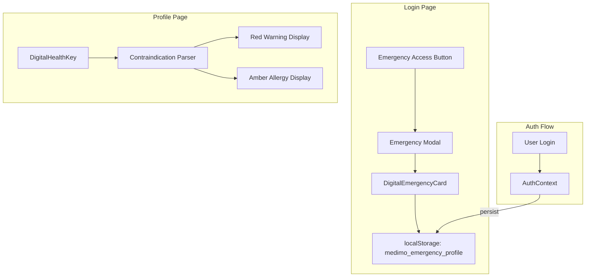

                                                       # Simulation Findings Fix Plan ✅ COMPLETE

Comprehensive plan to address the 3 critical issues identified in the Argentina Emergency Scenario simulation.

> [!NOTE]
> **All fixes implemented and verified.** See [walkthrough.md](file:///C:/Users/Monya/.gemini/antigravity/brain/edd957ce-db73-4e61-b824-b055da3b3f31/walkthrough.md) for details.


---

## User Review Required

> [!CAUTION]
> **Emergency Data Persistence**: The plan proposes storing critical medical data in `localStorage` for offline/logged-out emergency access. This allows first responders to view allergies, blood type, and emergency contacts without login. Please confirm this is acceptable from a security/privacy perspective.

> [!IMPORTANT]
> **Global Font Size Increase**: Changing base font from 14px → 16px will affect the entire application's visual appearance. This is a necessary accessibility fix for elderly users.

---

## Proposed Changes

### Component 1: Emergency Modal Digital Card

**Issue**: The Emergency Access modal on LoginPage currently shows static instructional text only. It fails to display the digital QR code or core medical information.

**Solution**: Create a `DigitalEmergencyCard` component that reads from `localStorage` and displays critical info even when logged out.

#### [NEW] [DigitalEmergencyCard.tsx](file:///c:/Users/Monya/Documents/05%20RESOURCES/CODE%20AND%20APPS/Medimo/src/components/features/DigitalEmergencyCard.tsx)
- Reads emergency data from `localStorage` (key: `medimo_emergency_profile`)
- Displays:
  - Blood Type (prominent display)
  - Allergies (amber warning chips)
  - Contraindications (red warning chips for "No X-Ray", "No MRI")
  - Emergency Contact with call button
  - QR Code image (if previously generated)
- Includes "No data available" state when localStorage is empty

#### [MODIFY] [LoginPage.tsx](file:///c:/Users/Monya/Documents/05%20RESOURCES/CODE%20AND%20APPS/Medimo/src/pages/LoginPage.tsx)
- Import and render `DigitalEmergencyCard` in the Emergency Modal
- Replace static instructional text with the digital card
- Keep "Call Emergency Services" button

#### [MODIFY] [AuthContext.tsx](file:///c:/Users/Monya/Documents/05%20RESOURCES/CODE%20AND%20APPS/Medimo/src/contexts/AuthContext.tsx)
- Add function to persist critical emergency data to `localStorage` on login
- Key: `medimo_emergency_profile`
- Data: `{ bloodType, allergies, emergencyContact, importantNotes, qrCodeUrl }`

---

### Component 2: Font Size Accessibility

**Issue**: Base font (14px) and H2 headers (20px) fail elderly accessibility requirements (≥16px body, ≥24px headers).

#### [MODIFY] [index.css](file:///c:/Users/Monya/Documents/05%20RESOURCES/CODE%20AND%20APPS/Medimo/src/index.css)

```diff
 @layer base {
+  html {
+    font-size: 16px; /* Accessibility baseline - elderly users */
+  }
+  
   body {
     @apply bg-background text-foreground;
     font-family: 'Inter', ...;
   }
   
-  h2 { font-size: clamp(1.5rem, 3vw, 2rem); line-height: 1.2; }
+  h2 { font-size: clamp(1.5rem, 3vw, 2rem); line-height: 1.2; min-font-size: 1.5rem; }
```

**Changes**:
- Add explicit `html { font-size: 16px; }` declaration
- Ensure clamp minimum for H2 is 24px (1.5rem × 16px = 24px)
- Add `.input-premium` font-size: 1rem (16px)

---

### Component 3: Contraindication Warning Visibility

**Issue**: Critical warnings like "No X-RAY" are displayed in standard amber alert, easily missed in trauma situations.

**Solution**: Parse Important Notes for contraindication keywords and display them with distinct red styling.

#### [MODIFY] [DigitalHealthKey.tsx](file:///c:/Users/Monya/Documents/05%20RESOURCES/CODE%20AND%20APPS/Medimo/src/components/features/DigitalHealthKey.tsx)

Add contraindication parsing and red warning display:

```diff
+// Contraindication keywords
+const CONTRAINDICATIONS = ['no x-ray', 'no mri', 'no radiation', 'pregnant'];
+
+const extractContraindications = (notes: string) => {
+  return CONTRAINDICATIONS.filter(keyword => 
+    notes.toLowerCase().includes(keyword)
+  );
+};

// In render:
+{/* Critical Contraindications - Red Warning */}
+{contraindications.length > 0 && (
+  <div className="bg-red-50 dark:bg-red-950/30 border-2 border-red-300 dark:border-red-700 rounded-xl p-4">
+    <div className="flex items-center gap-2 mb-2">
+      <XCircle className="h-5 w-5 text-red-600 animate-pulse" />
+      <span className="text-sm font-bold uppercase tracking-wider text-red-600">
+        CRITICAL CONTRAINDICATIONS
+      </span>
+    </div>
+    <div className="flex flex-wrap gap-2">
+      {contraindications.map((item, i) => (
+        <span key={i} className="px-3 py-1.5 bg-red-100 border border-red-300 rounded-full text-sm text-red-700 font-bold">
+          ⚠️ {item.toUpperCase()}
+        </span>
+      ))}
+    </div>
+  </div>
+)}
```

#### [MODIFY] [index.css](file:///c:/Users/Monya/Documents/05%20RESOURCES/CODE%20AND%20APPS/Medimo/src/index.css)
Add critical warning utilities:

```css
/* Critical Contraindication Warning */
.warning-critical {
  background: var(--hc-accent-critical-soft);
  border: 2px solid var(--hc-accent-critical);
  border-radius: 0.75rem;
}

.chip-contraindication {
  background: #FEE2E2;
  color: #DC2626;
  border: 1px solid #FECACA;
  font-weight: 700;
}
```

---

## Verification Plan

### Browser Testing (Port 8080)

1. **Emergency Modal Test**
   - Navigate to `http://localhost:8080/login`
   - Click "Emergency Access" button
   - **Expected**: Modal displays digital emergency card with:
     - Blood Type: "O-"
     - Allergies: "Penicillin", "Sulfa drugs", "Latex" (amber chips)
     - Contraindication: "NO X-RAY" (red warning)
     - Emergency Contact: "David"
     - QR Code image (if available)

2. **Font Size Accessibility Test**
   - Navigate to `http://localhost:8080/` (Dashboard)
   - Open browser DevTools → Computed Styles
   - Check `body` font-size → **Expected**: 16px
   - Check `h2` elements → **Expected**: ≥24px
   - Check input fields → **Expected**: ≥16px

3. **Contraindication Visibility Test**
   - Navigate to `http://localhost:8080/profile`
   - Expand Digital Health Key card
   - **Expected**: Red banner with "CRITICAL CONTRAINDICATIONS" and "NO X-RAY" chip distinct from amber allergies

### Manual Verification (User)

After implementation, manually verify:
1. Emergency Modal shows real medical data for the logged-in user
2. Logout and verify Emergency Modal still shows data from localStorage
3. Confirm font sizes are comfortable for reading

---

## Architecture Diagram


